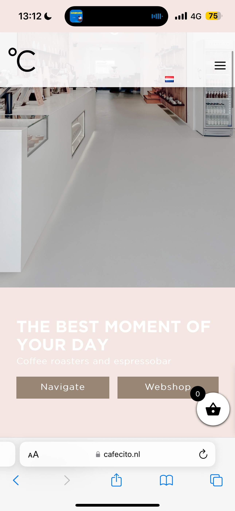
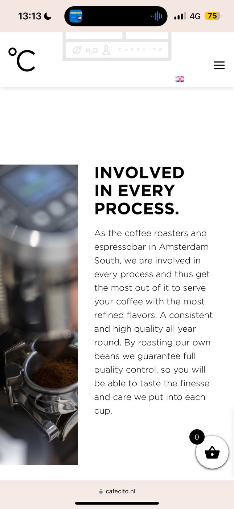

# Procesverslag
Markdown is een simpele manier om HTML te schrijven.  
Markdown cheat cheet: [Hulp bij het schrijven van Markdown](https://github.com/adam-p/markdown-here/wiki/Markdown-Cheatsheet).

Nb. De standaardstructuur en de spartaanse opmaak van de README.md zijn helemaal prima. Het gaat om de inhoud van je procesverslag. Besteedt de tijd voor pracht en praal aan je website.

Nb. Door *open* toe te voegen aan een *details* element kun je deze standaard open zetten. Fijn om dat steeds voor de relevante stuk(ken) te doen.

## Jij

  
uitwerken voor kick-off werkgroep

  ### Auteur:
    Collins Animah

  #### Je startniveau:
    Blauw

  #### Je focus:
    Surface Laag
 

## Je website

  
uitwerken voor kick-off werkgroep

  ### Je opdracht:
  https://cafecito.nl

  #### Screenshot(s) van de eerste pagina (small screen): 
    
  
  
  #### Screenshot(s) van de tweede pagina (small screen): 

  
 

## Toegankelijkheidstest 1/2 (week 1)

  
uitwerken na test in 2e werkgroep

  ### Bevindingen
  Lijst met je bevindingen die in de test naar voren kwamen:
  Dingen die in de test naar boven kwamen zijn dat

  - Er zijn veel soort beperkingen die voor iedereen anders zijn
  - Bij het ontwerpen van mijn site wil ik extra aandacht besteden aan de alt tekst bij de afbeeldingen
  er staat nu namelijk nog helemaal geen alt tekst bij en ik wil dit dus vervangen door uitgebreide omschrijvingen
  om zo de gebruikerservaring voor slechtziende mensen te bevorderen.
  - In de landscape mode op de telefoon ziet de site er niet mooi uit, dit is een extra die ik zou willen aanpakken mits ik de tijd hiervoor heb.
  

## Breakdownschets (week 1)

  
uitwerken na afloop 3e werkgroep

  ### de hele pagina: 
  

## Voortgang 1 (week 2)

  
uitwerken voor 1e voortgang

  ### Stand van zaken
  hier dit ging goed & dit was lastig (neem ook screenshots op van delen van je website en code)

  ### Verslag van meeting
  hier na afloop snel de uitkomsten van de meeting vastleggen

De eerste meeting heb ik gehad met de studentenassistenten, ik wist eerst niet zo goed wat ik hierbij moest verwachten, ik was nog best wel in mijn beginfase en had vooral feeback gevraagd op hoe mijn html code was opgbeouwd.

Hierin kreeg ik te horen dat ik
- Goed moest kijken naar welke elementen ik waar heb toegepast
- Waarom ik dit heb gedaan (kunnen uitleggen)

Ook wil ik een effect toevoegen dat afbeeldingen in het beeld komen tijdens het scrollen en had ik gevraagd hoe ik dat moest doen
en hiervoor kreeg ik het antwoord

- Intersect (hier ga ik zelf nog onderzoek naar doen)

## Voortgang 2 (week 3)

  
uitwerken voor 2e voortgang

  ### Stand van zaken
De site  komt mooi samen, ik heb nu ook css toegepast op mijn 1e html pagina en het begint ergens op te lijken

  ### Agenda voor meeting
  Deze meeting had ik met de docent,

  de vragen die ik voor deze meeting heb zijn: 

  - Mag ik linkjes buiten de section plaatsen?
  - Hoe kan ik buttons in een section centreren?
  - Ik heb een a:hover in CSS geplaatst alleen werkt deze niet, weet u waarom?

  ### Verslag van meeting
Al mijn 3 vragen zijn beantwoord
- Linkjes mag ik gewoon buiten een section plaatsen
-Om buttons in een section te centreren mag ik een div gebruiken, dit mag gewoon als het puur styling gerelateerd is.
- De reden waarom mijn a:hover het niet deed was omdat mijn scherm in toestelmodus stond, hierdoor gaat hij er van uit dat je op een telefoon zit, en hierop kan dan dus ook niet gehoverd worden.

## Toegankelijkheidstest 2/2 (week 4)

  
uitwerken na test in 9e werkgroep

  ### Bevindingen
Ik heb een paar punten in mijn site kunnen verbeteren.
deze punten zijn 

-Goede alt tekst toevoegen
-Een filmpje toevoegen die een pauze functie heeft
-Dark mode die er ook nog eens netjes uit ziet
-Alle code komt foutloos door de validator heen
-Ik heb een UL toegepast

Al met el ben ik zeer tevreden met hoe ik dit heb opgelost

## Voortgang 3 (week 4)

  
uitwerken voor 3e voortgang

  ### Stand van zaken
Op dit moment zat ik eigenlijk leker in de flow met mijn site maken en liep ik nog niet tegen dingen aan, ik had voor deze meeting dan ook geen specifieke vragen.

  ### Agenda voor meeting
  -

  ### Verslag van meeting
Ik had dus geen vragen maar ik heb wel algemene feedback ontvangen op hoe mijn site eruit zag en dit was positief. Ook heb ik inspiratie kunnen opdoen bij medestudenten.

## Eindgesprek (week 5)

  
uitwerken voor eindgesprek

  ### Je uitkomst - karakteristiek screenshots:

  
  
  

  ### Dit ging goed/Heb ik geleerd: 
Ik en code schrijven zijn gewoon niet 1 maar ik ben trots op wat ik heb neergezet, as we speak ben ik ook bezig met de herkansing van internetstandaarden en project individueel 1, dit heb ik beide niet gehaald doordat ik code lastig en niet leuk vond.
Dit vak heeft mij op dit gebied dan ook zeker geholpen omdat ik veel meer begrijp en veel kan met code, dit is naast de duidelijke opdrachten ook te danken aan de goede uitleg en lessen van Vasilis.

  

  ### Dit was lastig/Is niet gelukt:
Ik heb geprobeerd om de intersect toe te voegen aan mijn code voor de afbeeldingen alleen is dit niet gelukt, mijn hele code ging hierbij breken en ik heb daarom besloten om dit te skippen. Ik vind dit wel jammer

  

## Bronnenlijst

  
continu bijhouden terwijl je werkt

https://www.w3schools.com/tags/att_video_autoplay.asp - dit is voor de autoplay video

 https://youtu.be/5yl75eM0Y4A?si=BcgK5QzmBAotsg3v - De fade in animatie op de images

